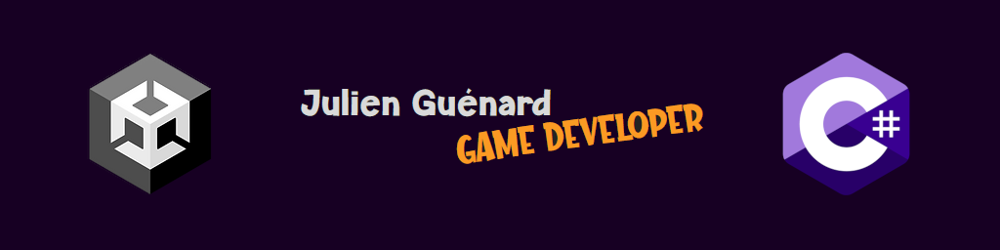
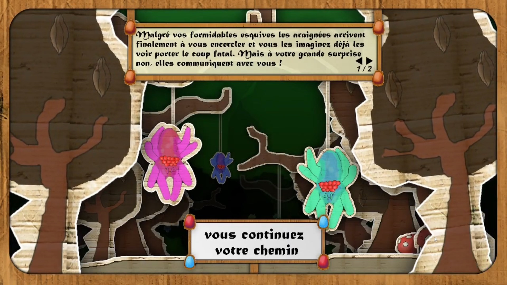
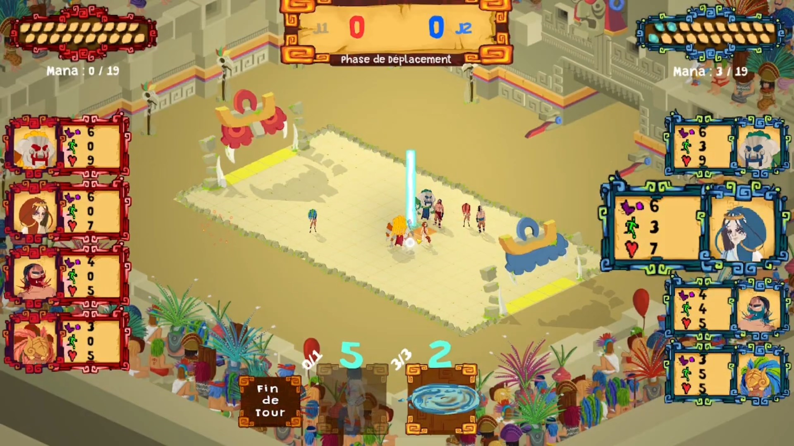
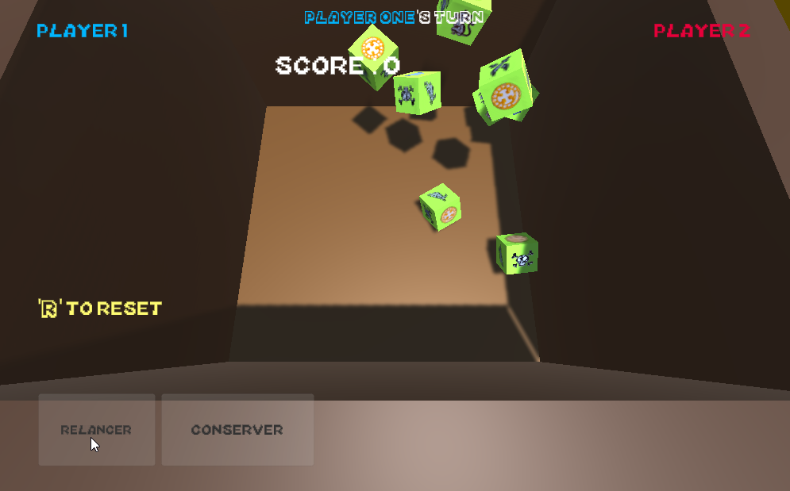
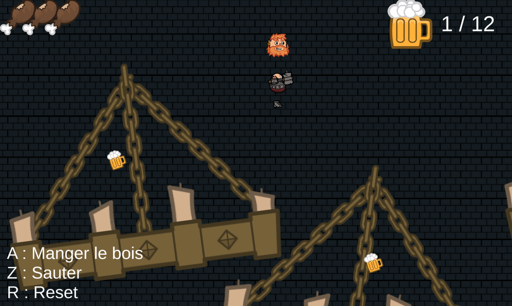
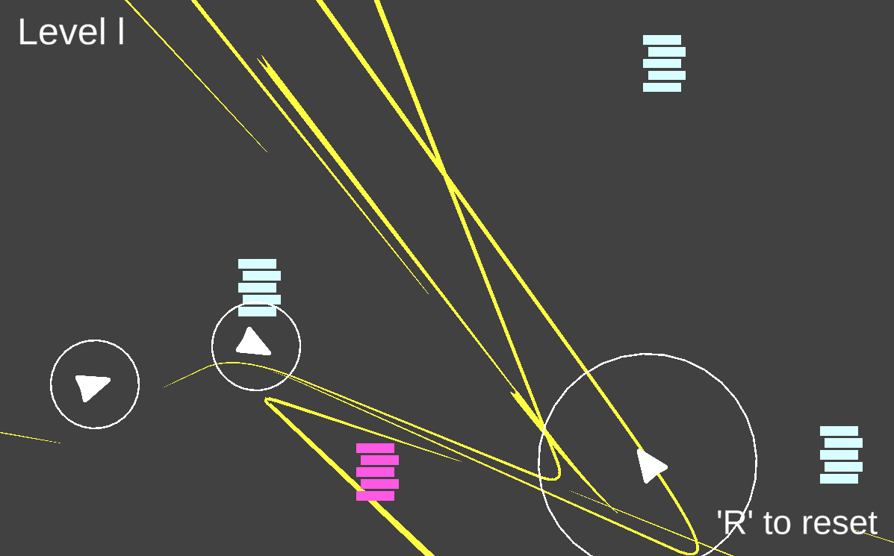
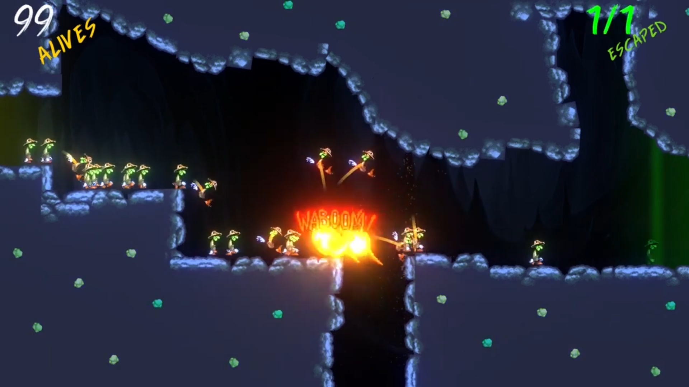

  

---

 
  &nbsp
  &nbsp
  &nbsp
  &nbsp
  &nbsp
  

---

<!-- Badges -->

# Liens
  * <a href="https://www.youtube.com/channel/UCwxuydeEi6WyM-X6nsPs-8A">Youtube</a>
  * <a href="https://archer01.itch.io/">Itch.io</a>
  * <a href="https://hashnode.com/@Archer01">Hashnode (Dev Blog)</a>
  * <a href="https://www.linkedin.com/in/julienguenard/">Linkedin</a>
  * <a href="https://twitter.com/julien_guenard">Twitter</a>
  
  ---
  
  # Projets Unity
  
   ## Projets personnel
  * <a href="https://archer01.itch.io/mille-sabords">(Play game)</a>&nbsp;
  <a href="https://github.com/JulienGuenard/Mille-Sabords">Mille Sabords</a>

   ## Projets étudiant
  * <a href="https://github.com/JulienGuenard/Orbeon">Orbeon</a>
  * <a href="https://github.com/JulienGuenard/Pyromancer">Pyromancer</a>
  * <a href="https://github.com/JulienGuenard/Candy-Land">Candy Land</a>

   ## Exercices
  * <a href="https://github.com/JulienGuenard/2D-Titan-Souls-Like">(Play game)</a>&nbsp;
  <a href="https://github.com/JulienGuenard/Flooded-Village">Titans Souls</a> 
  * <a href="https://archer01.itch.io/dwarf-platformer-2d">(Play game)</a>&nbsp;
  <a href="https://github.com/JulienGuenard/2D-Platform---Cours-3WA">2D Platform Dwarf</a>
  * <a href="https://archer01.itch.io/ui-exercice">(Play game)</a>&nbsp;
  <a href="https://github.com/JulienGuenard/UI-Exercice">UI Exercice</a>
  * <a href="https://archer01.itch.io/auditorium">(Play game)</a>&nbsp;
  <a href="https://github.com/JulienGuenard/Piratorium">Auditorium</a>
  * <a href="https://archer01.itch.io/flooded-village">(Play game)</a>&nbsp;
  <a href="https://github.com/JulienGuenard/Flooded-Village">Flooded Village</a>

